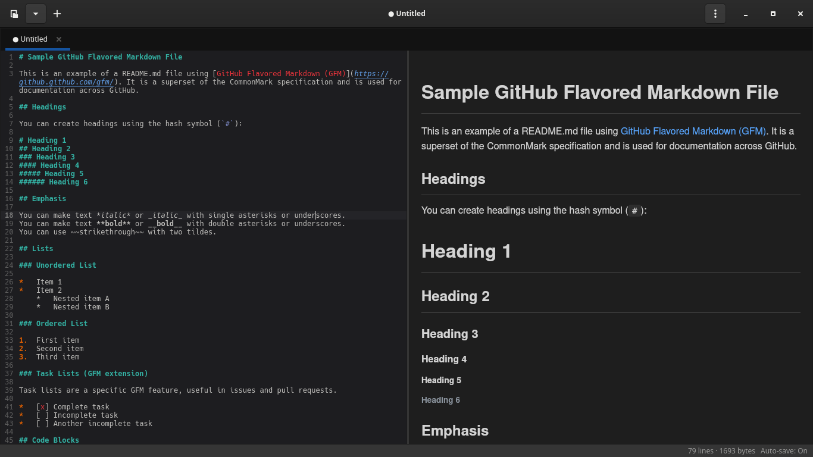

# jetmd

jetmd is a lightweight tabbed Markdown editor for Linux, built in Rust with [GTK 4](https://gtk.org/), [GtkSourceView 5](https://wiki.gnome.org/Projects/GtkSourceView), [WebKitGTK 6](https://webkitgtk.org/), and [pulldown-cmark](https://github.com/raphlinus/pulldown-cmark).



## Features

- Tabbed Markdown editing with multi-document workflows
- Live preview with editor, split, and preview-only layouts
- Find and replace, recent files, and keyboard shortcuts for everyday editing
- HTML export for sharing rendered documents
- Dark/light themes, optional auto-save, and draft recovery for unsaved work

## Quick Start

- Install the required system packages described in [docs/installation.md](docs/installation.md).
- Build the project:

```bash
cargo build --release
```

- Run the app:

```bash
cargo run --release
```

- Open a file directly at startup if needed:

```bash
cargo run --release -- path/to/file.md
```

## Documentation

- [Installation](docs/installation.md) — system dependencies, build steps, and run instructions
- [Usage](docs/usage.md) — Markdown support, editing workflow, auto-save behavior, and keyboard shortcuts
- [Architecture](docs/architecture.md) — module responsibilities and runtime behavior
- [Project Structure](docs/project-structure.md) — source tree overview
- [Development](docs/development.md) — test coverage and developer workflow

## License

Licensed under either of:

- Apache License, Version 2.0
  ([LICENSE-APACHE](LICENSE-APACHE) or https://www.apache.org/licenses/LICENSE-2.0)
- MIT License
  ([LICENSE-MIT](LICENSE-MIT) or https://opensource.org/licenses/MIT)

at your option.
